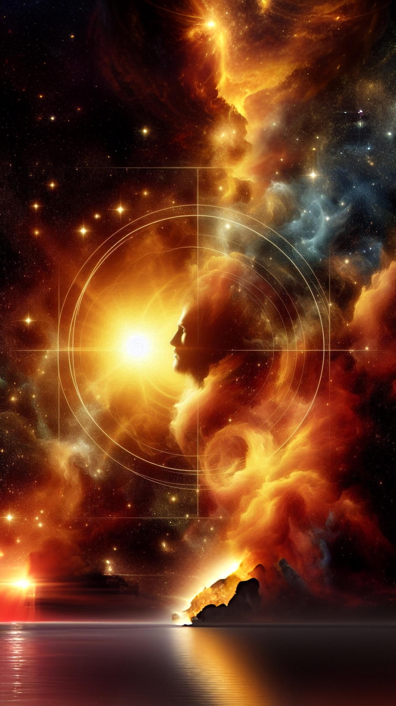
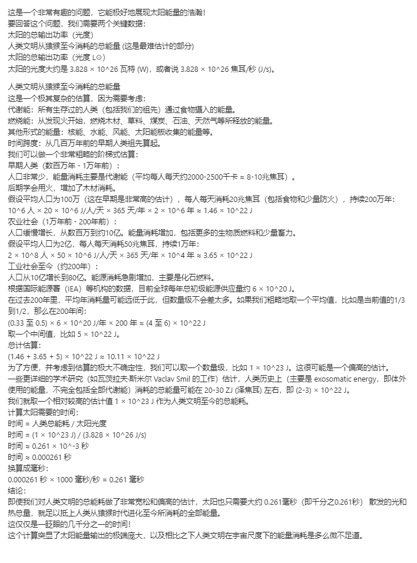
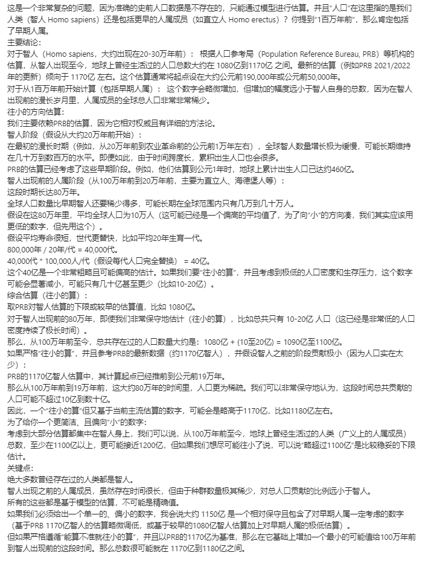

太阳钱币◎(特别篇)

文:灏宇(灏宇|灏宇水鱼|XC2116)

#**《太阳钱币法则◎》**

Part.1-序幕    ◎

-

——（前文回顾：在狩猎太阳◎(特别篇)一文之中，我认知到了太阳能量的浩瀚程度，这也成为了我在后续自学当中，构想出“太阳钱币”价值框架的重要契机。

——（致我一直忽视的太阳。

——（🌅

——2025年05月28日，我在遍历《真相系列》的过程中，基于之前的笔记，被触发出了一个灵感，这一灵感通过向ai询问如下问题，得到了一个答案，并于当日的晚上20点49分将其记录在了自己的“灵感管理体系”之内，由于过程较为复杂，而我的计算能力还达不到能够引经据典的验证那些过程的水平，所以只建议有兴趣的朋友研究这个过程，没有兴趣的可以直接跳过下图中的计算过程。

——前排提醒！！！如果阅读过程中，有感觉到理解能力跟不上的话，请不要勉强自己，直接跳到结论部分“Part.4-终章”，看完结论，再返回来，作为看完结论的，新版本的自己，更从容的重新开始自己的重新理解之路。

Part.2-推理-1 ◎

-

——（对Gemini2.5的提问：太阳多少时间散发的光总量够人类文明从无（猿猴）发展至今？

图一

——通过上述过程，我得出了一个结论，太阳只需要发散0.000261秒的能量，就足以用于创造一个人类文明(Human civilization)，当然，是在忽视其他必要条件的情况下。注意，并且这里说提的这个人类文明，是自诞生到公元21世纪期间的人类文明，它并未包括公元21世纪之后的人类文明。

——而在人类文明已经存在的基础上，人类社会(Human society)利用太阳能量的能力是能够不断增长的，而从历史发展的规律看来，人类社会利用太阳能量的能力，如果站在人类文明的尺度上看的话，毫无疑问正在按照指数增长(Exponential growth)的方式不断增加着，(例如说，技术爆炸)，并且不断向着实现戴森球(Dyson Sphere)的方向发展。当然，这只是目前为止在世界上人类社会所表现出的现象，并不意味着只要我们躺着等，指数增长就能继续实现下去。

——戴森球，是一种设想中的、能够完全包围一整颗恒星，并且获得其几乎全部能量输出的巨型人造结构。太阳从属于恒星，或者说，太阳就是一种恒星。

——如果以人类文明作为代表太阳发散0.000261秒的总能量的基本单位(Basic unit)的话，通过计算可以得出，在1秒的时间里太阳发散的总能量，大约相当于3,831个人类文明。

——反过来，11494.25人类文明，就相当于在3秒的时间里太阳发散的总能量，为了框架直观，我们可以再反过来认为，在3秒的时间里太阳发散的总能量，就相当于10,000人类文明，而为了表达直观，我们可以定义太阳钱币(Sun Coin)这个词汇作为代表3秒的时间里太阳发散的总能量的基本单位，1太阳钱币=10,000人类文明。之所以1太阳钱币在之后的架构过程中≠11,494.25人类文明，是我为了实现价值框架的实用性和易懂性，所做的“定义上的调整”或“取舍”。

——也因此我们可以反过来重新定义人类文明，即人类文明代表太阳发散0.0003秒的总能量，这样之后，在我们的后续推理之中，人类文明就变得比起之前而言，还要更加的有价值了。

——按照《狩猎太阳》中的数据，在同一时间中，地球只能从太阳那里接收到

0.000000045%的太阳能量，而人类社会在这其中所能利用乃至存储的比例同样微小到不可思议。

——太阳所储存的总能量是有限的。所以，人类文明因为尚未形成戴森球和太阳能量的自然发散而损失的、原本可以用于发展人类文明的太阳能量的总能量无时无刻不在按照线性增长(Linear growth)的方式不断增加着。而因为目前的人类社会所能利用的太阳能量实在是少到微不足道，所以在后面推理中省略不计。因为省略不计，所以可以认为在目前，太阳自然发散的总能量就约等于人类文明损失的总能量。

——当人类文明形成戴森球之后，太阳能量的自然发散就会被全部接收起来，进而不再会有任何损失，但，因为更晚形成，而造就的损失，因为太阳所存储的总能量是有限的，未来的人类文明永远都无法挽回。

——因此，我们可以这么认为，人类文明形成戴森球的时间，每早上3秒，就可以为人类的未来多攒下10,000个人类文明。

——2021年，全球的平均预期寿命(Average life expectancy)是71.4年，考虑到未来的平均预期寿命会越来越高，我们可以视作每个普通人(Ordinary People)平均下来有30,000天的平均预期寿命，即82.1年。

——全球人口数量(Global population size)在2022年11月15日达到了80亿，考虑到未来的全球人口数量会越来越大，我们可以视作全球人口数量有100亿这么多。

——那么，一代人类社会，在它一生中的30,000天里，就会因为没有实现戴森球而损失掉864,000,000 个太阳钱币，而这，相当于8,640,000,000,000 个人类文明。

——如果将一代人类社会的身上所承担，或者说在人类文明之中所负责的不可挽回的总损失，均摊到每个普通人身上的话，那么每一个普通人大约会分到 0.0864 个太阳钱币，也就是864个人类文明。也就是说，每一个普通人从他们的刚出生开始，就自然而然的承担着864个人类文明的损失。在人类文明实现戴森球的历史征程之中，每个普通人的历史影响力(Historical influence)，实际上都难以估量。

——人类文明的诞生可以追溯到大约200万年前至10万年前，那是人属中的直立人所存在的时期，而最原始的文明美索不达米亚文明（苏美尔文明）则追溯到约公元前3,500年左右，基于之前图中对于人类文明代表的总能量的计算追溯到了几百万年前，我们可以认为一个人类文明的寿命有1,000,000年之久，也就是一百万年。

——在上述情境中，每个普通人被均摊到那么多的太阳钱币之后，平均每秒(Average per second)所被摊到的太阳钱币大约是 3.333 × 10⁻¹¹ 个，为了直观，我们可以将3.333简略为3，然后经过换算，我们可以得出，那大约是3 × 10⁻⁷个人类文明，再经过换算，相当于是0.3年的人类文明寿命/秒。

Part.3-推理-2 ◎

-

——写到这里时，我发现，在之前自己对于太阳钱币的思考中对人类文明的“文明人口数量(Civilized population size)”扩展未考虑到以前的全球人口数量没有现在这么多，所以我又临时性的问了这样一个问题。

——（对Gemini2.5的提问：我们现在来算算，从1百万年前到现在总共存在过多少的人口？如果算不准就往小的算

图二

——通过上述过程，我得出了一个结论，人类文明历史上所涉及的总人口数量，即文明人口数量，至少在1,100亿以上，为了直观，接下来我们将把文明人口数量视作1,000亿，文明人口数量由历史人(Historical person)组成，历史人与之前的普通人不同，代表着人类文明中的人类的平均水平，而非当代人类社会的人类的平均水平，而历史人的寿命，自然也没有普通人的寿命那么长。

——总而言之，之前的0.3年的人类文明寿命/秒，由此，就可以换算为30,000个历史人的一生/秒。

——补充：(0.3年文明寿命/秒) * (1,000亿历史人 / 100万年文明寿命) = 30,000历史人/秒。

——回顾一下，在我们前面的推理过程中，我们得出过这么个结论，即现代人类社会的全球人口数量有100亿之多。因此我们可以认为，每10个历史人当中，就有1个历史人同时还是普通人。所以，30,000个历史人的一生/秒，由此，就可以换算为3,000个普通人和27,000个不是普通人的历史人的一生/秒。

——这么一看，我们的历史影响力，有多么恐怖，也就显而易见了——我们的每刻每秒，(注意，不是每分每秒！)，其实都有机会为人类文明积累出3,000个像我们这样的普通人，以及27,000个不像我们这样但也一样拥有生命与人权的历史人的一生。

——在这点上，我有一个很不客气的类比，已经用白框白字隐藏在下面了，自觉心理承受能力不够强，或者自觉只需要过好自己这一生当个人间过客即可的朋友，请不要复制去看，毕竟你们并不适用于这个类比，你们跟我们玩的，全然不是一个游戏，这就好像，竞速游戏的玩家没理由去说享受游戏的玩家慢吞吞一样，哪怕最终在现实内，是前者改善社会的努力，在客观现实上造福着后者。

——类比：

——现代人类社会的普遍摆烂的普通人，就像是继承了亿万家产后却只知道去工地搬砖换钱的二愣子一样。

——哪怕亿万家产天天被管家拿去不知道做什么事情，也因为是个二愣子而意识不到，傻呵呵的继续去赚工地的钱，吃工地的饭，觉得这样挺好，而不是用那亿万家产去自己赚钱。

——毕竟，人是生物，生物只要能温饱就已经实现了基本满足了。

——但我觉得，我们不能那样。

——既然我们哪怕只是作为普通人，都天然就具备着这样的历史影响力，那么，就应该对那些我们有机会创造出的、哪怕均摊后都有864个的的人类文明，负责。

——请原谅我用了这么激烈的措辞。

——毕竟，在认知到这个事实之后，我的精神和表达会不可避免的有些偏激，我不想当教师，称不上老师，更不是全知全能的神，我也是普通人的一份子，甚至我私下还有一些很主观性的措辞，那些措辞，其实比这些还要激烈……

——毕竟，每分每秒，都有无数个原本可能鲜活灿烂的活出一生的普通人，在我身上，直接失去了降临到这个世界之上的机会。

Part.4-终章    ◎

-

——总结一下，在上述推理中，我们一共发现了以下三个基本公理。

——第一条基本公理：在忽视其他必要条件的情况下，太阳自然发散0.3毫秒的能量就足以用于创造一个自诞生到公元21世纪期间的人类文明。

-详细：太阳钱币价值公理——基于图一计算结果，太阳只需要发散0.000261秒的能量，就足以用于创造一个人类文明（特指自诞生到公元21世纪期间的人类文明，且忽视其他必要条件）。基于直观考虑，我们可以将0.000261秒四舍五入的视作0.0003秒，为了方便计算，我们提出“太阳钱币”作为代表太阳发散3秒的能量对应的基本单位，于是，我们可以得到下列的能量等价公式，1 太阳钱币 ≡ 3秒太阳能量 ≡ 10,000 人类文明。

——第二条基本公理：人类文明每晚一秒建成戴森球，都会造成不可挽回的未来可利用能量损失，而现代人类社会因为利用太阳能量的能力太差而可以简单视作正在完全浪费着太阳自然发散所输出到宇宙中的所有能量。

-详细：戴森球损失公理——人类文明等级根据卡尔达肖夫指数分为三个等级，{一/二/三}级文明能够完全利用{其所在行星/一颗恒星/整个星系}上的能量资源，戴森球是一个通过包围恒星进而利用其全部能量的人造结构，因此属于二级文明所创造出的设施。太阳就是一种恒星。恒星如太阳所储存的总能量是有限的且无时无刻不在自然发散，若这些自然发散的能量未被人类文明利用，那么哪怕未来的人类文明在以后建造起了戴森球，那些未被利用且已经自然发散的能量也会成为人类文明永远无法挽回的损失。基于狩猎太阳◎(特别篇)图内计算结果，(地球接收到的太阳能量占太阳总辐射能量的比例极其微小，仅有0.000000045%)，由于目前地球所能接收到的和人类社会在局限于地球的基础上在地表上中能够实际利用的太阳能量比例皆极小，(毕竟，当代人类社会目前只算零级文明，甚至还没有达到一级文明的高度)，因此可以近似认为，当前太阳每时每刻所自然发散的总能量几乎全部等同于人类文明的损失量。此损失的速率是基本恒定的（每3秒损失1太阳钱币，或每0.0003秒损失1个人类文明单位的能量），因此累计损失量会随时间推移而不断的线性增长。

——第三条基本公理：自诞生到公元21世纪期间的人类文明有着百万年的历史，其中有1,000亿的历史人曾经或正在活着。当代人类社会的全球人口数量有约100亿，在这其中的当代人类社会的普通人的平均预期寿命有30,000天。

-详细：人类世界量化公理——基于人类文明的历史可以追溯到百万年前，一个标准人类文明（除了作为能量单位外），在其历史演化维度上，被设定拥有1,000,000年（一百万年）的理论寿命。基于图二计算结果，在此百万年寿命周期内，一个标准的人类文明承载过总计1,000亿“历史人”的人口数量。（“历史人”指代的是人类文明从古至今所有成员的平均化概念，其平均寿命低于“现代普通人”）。基于2021年全球的平均预期寿命是71.4年，考虑到未来的平均预期寿命会越来越高，我们可以简单视作每个普通人平均下来有30,000天的平均预期寿命，即82.1年。现代人类社会的全球人口数量在2022年11月15日达到了80亿，考虑到未来的全球人口数量会越来越大，我们可以简单视作当代人类社会的全球人口数量有100亿这么多。通过100亿/1,000亿=1/10可知，每10个历史人里就有一个(现代人类社会当中的拥有30,000天的平均预期寿命的)普通人。

——在上述中的三个基本公理的基础之上，经过一系列的推理，我们一共推理出了以下三个定理。

——第一定理：当代人类社会在其长达30000天的一生之中将会损失864,000,000 个太阳钱币。

-详细：当代人类社会历史影响力定理——由当代普通人所形成的当代人类社会，在其所对应的一整个生命周期内，即30000天，因未能建成戴森球而共同造成的太阳能量总损失量为 864,000,000 个太阳钱币，这相当于8,640,000,000,000 个人类文明（能量单位）。

-推导依据：

 普通人平均预期寿命 = 30,000天 (来自【人类世界量化公理】)

 每天秒数 = 24小时/天 * 60分钟/小时 * 60秒/分钟 = 86,400秒/天

 普通人一生总秒数 = 30,000天 * 86,400秒/天 = 2,592,000,000秒

 能量损失速率 = 1 太阳钱币 / 3秒 (来自【定理一】)

 一代人生命周期内的总损失 = (2,592,000,000秒) / (3秒/太阳钱币) = 864,000,000 太阳钱币

 换算为人类文明单位 = 864,000,000 太阳钱币 * 10,000 人类文明/太阳钱币 = 8,640,000,000,000 

 人类文明。

——第二定理：若将当代人类社会的损失均摊到其所包含的普通人，则当代普通人在其长达30000天的一生之中将会损失864个人类文明，除非通过推早戴森球的实现挽回。

-详细：普通人历史影响力定理——将第一定理中计算出的当代人类社会单代总能量损失，平均分摊到其所包含的100亿普通人身上，则每一个普通人在其一生的30,000天中，因人类文明未能建成戴森球而间接承担的能量损失份额约为 0.0864 个太阳钱币，这相当于864个人类文明（能量单位）。反之，如果普通人能够通过自己的努力，将戴森球的未来实现节点推得更早，就能够挽回——甚至继续拯救——数以千计的人类文明。

-推导依据：

 单代总损失 = 864,000,000 太阳钱币 (来自【定理二】)

 当代全球人口 = 100亿人 (来自【人类世界量化公理】)

 每人分摊损失 = 864,000,000 太阳钱币 / 10,000,000,000 人 = 0.0864 太阳钱币/人

 换算为人类文明单位 = 0.0864 太阳钱币/人 * 10,000 人类文明/太阳钱币 = 864 人类文明/人。

——第三定理：当代普通人平均每秒的价值相当于3,000个普通人和27,000个不是普通人的历史人的一生。

-详细：普通人平均每秒价值定理——每一位当代普通人，其每一秒钟因人类文明未能建成戴森球而间接分摊的能量损失，约等同于错失了0.3年人类文明寿命所对应的能量，这进一步相当于错失了30,000个历史人得以完整度过其一生的发展机会。又因为每10个历史人里就有一个(现代人类社会当中的拥有30,000天的平均预期寿命的)普通人，所以更进一步看，这就相当于错失3,000个普通人和27,000个不是普通人的历史人得以完整度过其一生的发展机会。

-推导依据：

 每普通人一生分摊损失 = 0.0864 太阳钱币 (来自【普通人历史影响力定理】)

 普通人一生总秒数 = 2,592,000,000 秒 (来自【人类世界量化公理】中 30,000天 * 86,400秒/天)

 每普通人每秒分摊太阳钱币损失 = 0.0864 太阳钱币 / 2,592,000,000 秒 ≈ 3.333 × 10⁻¹¹ 太阳钱币/

 秒

 (文中为直观表述，将3.333简略为3，即采用 3 × 10⁻¹¹ 太阳钱币/秒 进行后续计算)

 每秒分摊人类文明损失（能量单位） = (3 × 10⁻¹¹ 太阳钱币/秒) × (10,000 人类文明 / 1 太阳钱币) 

 = 3 × 10⁻⁷ 人类文明/秒 (换算依据【太阳钱币价值公理】)

 每秒损失对应文明寿命年数 = (3 × 10⁻⁷ 人类文明/秒) × (1,000,000 年文明寿命 / 1 人类文明) = 0.  

 3年文明寿命/秒 (换算依据【人类世界量化公理】)

 每秒损失对应历史人一生数量 = (0.3 年文明寿命/秒) × (1,000亿 历史人 / 1,000,000 年文明寿命) =   30,000 历史人的一生/秒 (换算依据【人类世界量化公理】)

 普通人占历史人比例 = 1/10 (来自【人类世界量化公理】中 100亿当代普通人 / 1,000亿历史人)

 每秒损失对应普通人一生数量 = 30,000 历史人的一生/秒 × (1/10) = 3,000 普通人的一生/秒

 每秒损失对应非普通人历史人一生数量 = 30,000 历史人的一生/秒 × (9/10) = 27,000 非普通人历史

 人的一生/秒

——最终，我们发现和了三条基本公理，推理出了三条定理，这些共同形成了一个价值框架，“太阳钱币”价值框架。其实，更严谨的说，这些所形成的是一个形式系统(Formal system)，太阳钱币形式系统，或者说太阳钱币法则(Sun Coin Rule)。

——太阳钱币法则所指出的最触目惊心的事实，莫过于普通人历史影响力定理，和普通人平均每秒价值定理，如果不是站在放眼未来的视角去看，我们全然不会意识到，我们的存在，对于整个人类文明，有着如此举足轻重的历史影响力。

——这就是我为这个世界带来的产品，自人生月报之后，再次打造出的第二个真正意义上改变了这个世界的产品，一个开源的、任何人都可以放心参照的、极度长期以至于贯穿了整个人类文明的未来的，思想的基石。

Part.5-尾声    ◎

-

——这不是科幻，而是现实。

——是我们熟视无睹、司空见惯的普遍现象之中所蕴含的，简简单单、明明白白的事实。

——但是，却比绝大多数的科幻，还要更加的极端，更加的令人心惊胆战。

——我不想用这篇文章去谴责任何人，所以我自己在此之上所延伸出的一些主观思考，在此不作举出。

——毕竟任何人都有权利，去选择他们用他们有限的人生，所要在这世界中进行的游戏。

——所以，在这里的，只是一些冷冰冰的、客观的数据事实，无论我们持有什么看法都不会改变的、不以人的意志为转移的客观事实。事实从未剥夺过任何人随心所欲、肆意生活的权利，只会沉默而不可动摇的酿造不为人的意志为转移的现实。

——有理性的人自会采纳，闹情绪的人自会忽视。

——总而言之，通过这篇文章，我成功为当代人类社会的中文世界和英文世界带来了一个全新的词汇，“太阳钱币(Sun Coin)”。

——就像笑来老师，李笑来，用他的书籍，《思考的真相》，为世界带来了几个中文世界里第一次出现的词，比如“一维因果世界”、“二维因果网络世界”、“三维因果系统世界”一般。

——请容许凭借着这样的贡献，让我狂妄地觉得，自己改变了世界。

——也希望我能以这篇文章，向你展示科学的魅力，科学的浪漫，科学的伟大。

——希望，我能以这篇文章，让你意识到，哪怕再微小的贡献，也能创造出极其宏大的历史影响力。

——但是，我更希望，你能永远不知足于微小的贡献——毕竟，如果只需要如此轻而易举的，以自己的力量推动着文明更快的创造出戴森球，就能如此深远的改变世界的话……那么，凭什么，要去停下成长的脚步？凭什么，要去质疑长期的力量？

---
**版权与许可 (Copyright & License)**

本作品《<a href="https://github.com/XC2116/XC2116-suncoin/blob/main/sun-coin.md">太阳钱币法则(Sun Coin Rule)◎</a>》由 <a href="https://github.com/XC2116">灏宇(XC2116)</a> 创作。
创作年份：2025

本作品采用 <a href="https://creativecommons.org/licenses/by-nc-sa/4.0/deed.zh-hans" rel="license noopener noreferrer" style="display:inline-block;">知识共享署名-非商业性使用-相同方式共享 4.0 国际许可协议</a> 进行许可。

---
**版权与许可 (Copyright & License)**

<a href="https://github.com/XC2116/XC2116-suncoin/blob/main/sun-coin.md">太阳钱币法则(Sun Coin Rule)◎</a> © 2025-06-02 by <a href="https://github.com/XC2116">灏宇(XC2116)</a> is licensed under <a href="https://creativecommons.org/licenses/by-nc-sa/4.0/">CC BY-NC-SA 4.0</a>

---
**商业使用与合作联系**

本人（灏宇(XC2116)）通过知识共享（Creative Commons）许可发布的，标记为‘非商业性使用 (NC)’的作品（例如本文《太阳钱币法则(Sun Coin Rule)◎》），其商业使用权需与本人单独协商。如果您希望将此类作品用于商业目的，或有其他合作意向，请通过以下方式联系我：
邮箱：1712919502@qq.com
温馨提示：为确保您的邮件被及时处理，如发送三天后未收到回复，欢迎通过您发现本作品的平台的留言功能或已知其他渠道提醒我查收邮件。您也可以在发送邮件后即留言告知。

---
**作者信息与作品存档声明**

作者：灏宇(XC2116)
本作已尝试在互联网档案库 (Internet Archive - archive.org) 进行存档。
也建议读者将感兴趣的作品进行个人备份。
© 2025 灏宇(XC2116). 保留所有权利。

